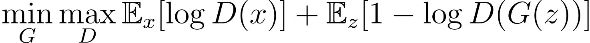
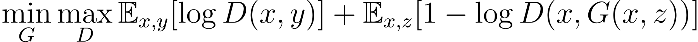
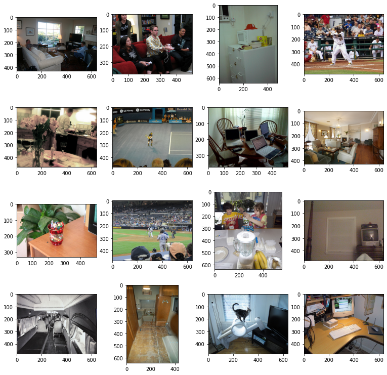
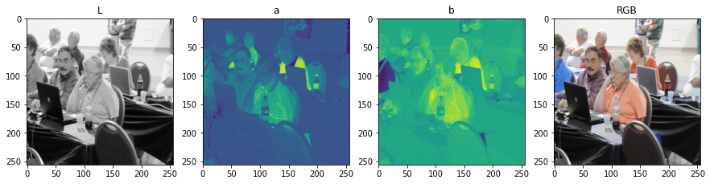
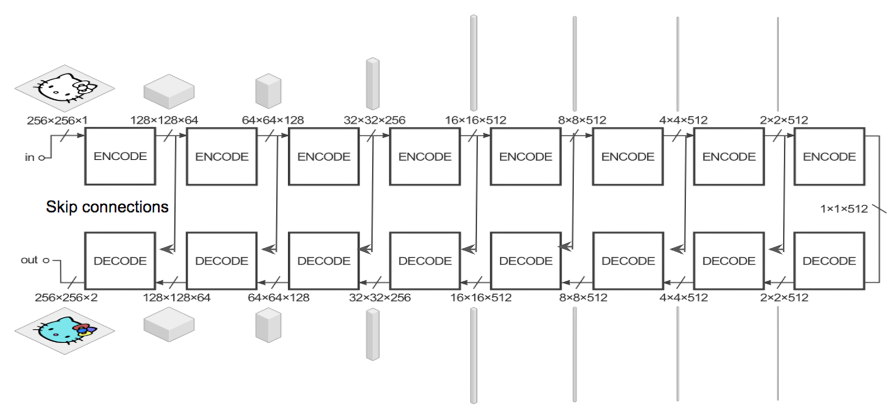

# Image-Colorization-Using-GAN
VLG Summer Open Project Submission 2022

## Table of Contents: 
* Project Overview
* Prerequisite Theory
* Data Description 
* Libraries used
* Steps followed
* Conclusion
* How to replicate on your device

## Overview of Project:
Colorizing black and white images has always been a difficult task which required a lot of human input and hardcoding. But this gruesome task could be automated with the use of an end-to-end deep learning pipeline. The network can take a black and white image as an input, then produce a fully colored image as output.
Therefore, the final goal of this project is to colorize black and white images with the help of Conditional Generative Adversarial Networks (or CGANs). 

Colorizing black and white images could be broadly categorized as an image to image translation task. Similar to language translation, we can have two different images relay the same information, hence one could be "translated" to the other. This image to image translation task has already been researched in a paper called <a href=https://arxiv.org/pdf/1611.07004.pdf>pix2pix Paper</a>, which again, uses Conditional GAN to fulfil the requirement.

## Prerequisite Theory
Before moving on to the description of model and results, let's first understand some basic things that are used throughout the project.

### Image Spaces
Since we are gonna be working with Black and white images, it is better to move the color space to L\*a\*b from RGB. This is because of two reasons:
* L\*a\*b space requires us to generate only two channels (*a and *b) using the L channel. Compare that with an RGB image, we can see that we are required to generate all three channels. This reduces the complexity of the network, hence reducing the training and testing time drastically.
* Also, it is easier to work with L\*a\*b images, simply because the input and output are very clearly divided where L is the input and \*a\*b is the output, which could be concatencated to produce the final image. No extra conversions are required, as compared to working with RGB image space.

Read more on <a href="https://en.wikipedia.org/wiki/CIELAB_color_space">L\*a\*b here</a>

### Generative Adversarial Networks
Generative Adversarial Networks, or GANs are an approach that's used for unsupervised learning tasks. They are often the backbones of the cool, realistic images generated by A.I. 

<a href="https://www.nvidia.com/en-us/research/ai-demos/">Nvidia AI Demos</a>, <a href="https://this-person-does-not-exist.com/en">ThisPersonDoesNotExist</a>, <a href="https://huggingface.co/spaces/dalle-mini/dalle-mini">DALL.E mini</a>, <a href="https://www.youtube.com/watch?v=6E1_dgYlifc">StyleGAN2 Interpolation Loop</a> to name a few

Instead of going into the in-depth detail of how they work, i'll try to give an intuition around their working.

So, basically, a GAN consists of two 'bots' who compete against each other (hence the adversarial term) where one generates some data, and the other determines whether the generated data is real or fake.\
 Well, Let's take a simple problem. We ask the generator to generate an image of a tree. Then we take it's output and feed it to the discriminator, which determines whether it's real or fake. Initially, the generator produces random gibberish. But as the process goes on, both the generator and discriminator improves by learning from one another, as both of them are trying to increase the loss of the other, hence learning in the process. The final goal of the generator is to produce outputs that are "indistinguishable from reality". Hence, this forces the discriminator to guess with a probability of 0.5 whether the generated data is real or fake provided enough training is done and generator starts producing photorealistic outputs.

As per my understanding, this works because calculating the loss of a generator using traditional loss functions such as L1 or L2 loss are not sufficient to make sure the generator learns well enough to be able to create realistic results. Take the problem at hand, colorizing black and white images. If we train the generator with an L1 loss function instead of a discriminator, It is observed to produce subpar, blurry results (Source: Pix2Pix Paper).
Therefore, to capture the losses for such complex problems, we require a complex and variable method to calculate the loss, which is exactly what the discriminator is training for. It is basically training to judge the generator's output.

For a simple GAN, the loss function is defined as:

Here, we can see that the objective of the Generator (G) is to minimize right term, while the discriminator (D) Maximizes the left term.

In case of a conditional GAN, alongside some random noise "z", we provide conditional input "x" to allow the GAN to have some supervision. 

Hence, The loss Function becomes:

Where, x is the label for input data. For B/W to color task, x is the L channel of image, z is random noise and y is the concatencation of \*a\*b channels).

## Data Description:
Since the task is simply colorization of black and white images, we don't need any specific labelled data. This allows us to use any image dataset containing various scenes for training. So i am using the COCO image dataset which contains various different images describing different objects and scenes. i used 8000 images for training and 2000 for testing.

The dataset is defined in the following directory structure:
<pre>
.
└── .fastai
    └── data
        └── coco_sample
            └── train_sample
                └── *.jpg (10,000 images in total)
</pre>

## Dependencies:
|   **Name**  |   **pip install Command**  |
|:-----------:|:--------------------------:|
|    Numpy    |     `pip install numpy`    |
|  Matplotlib |  `pip install matplotlib`  |
|    Torch    |     `pip install torch`    |
| Torchvision |  `pip install torchvision` |
|     Glob    |     `pip install glob2`    |
|     PIL     |    `pip install Pillow`    |
|   Skimage   | `pip install scikit-image` |
|     tqdm    |     `pip install tqdm`     |
|    fastai   |    `pip install fastai`    |

## Steps Followed

### Step 1. Importing Necessary Libraries
Getting all the required python libraries required for the implementation of the project, then defining the device to be used for calculations.

### Step 2. Fetching The Dataset and Setting Up Input Paths
Fetching the dataset using fastai (After installing and importing the module).Before defining training and validation paths, i am setting a seed of 123 to make sure that the fetched images are the same throughout different training sessions. Now, from that dataset, we fetch 10,000 images randomly using fastai.\
Then, these images are split randomly with 8,000 images to be used as training samples and 2,000 images for validation purpose.

Preview of the dataset:\
`['/root/.fastai/data/coco_sample/train_sample/000000051555.jpg'`\
 `'/root/.fastai/data/coco_sample/train_sample/000000533484.jpg'`\
 `'/root/.fastai/data/coco_sample/train_sample/000000134294.jpg'`\
 `...`\
 `'/root/.fastai/data/coco_sample/train_sample/000000128837.jpg'`\
 `'/root/.fastai/data/coco_sample/train_sample/000000164093.jpg'`\
 `'/root/.fastai/data/coco_sample/train_sample/000000333095.jpg']`

### Step 3. Defining Train and Test DataLoaders
Now the train dataset has 8000 images which can not be fed in one go. Therefore i define training and testing <a href="https://pytorch.org/tutorials/beginner/basics/data_tutorial.html">Dataloaders</a> with a batch size of 16 and 4 workers.\
Inside the dataloders, several preprocessing is done. the images are:
* Resized to 256x256 resolution
* Applying random horizontal flip (added after training for 350 epochs to see if results improve or not).
* Converted to L\*a\*b image space and values are normalized. 
* Now, these are split into `L_array and ab_array` having dimensions `1x256x256, 2x256x256` respectively.
Therefore, for a random element of train loader, we have:\
`L Array Shape : torch.Size([16, 1, 256, 256]) `\
`*a*b Array Shape : torch.Size([16, 2, 256, 256])`\
where, 16 is the batch size.

### Step 4. Modeling the Conditional GAN
#### 4.1 Modelling the Generator
Now comes the actual modelling part. i designed the generator according to what what defined in the pix2pix paper. So the generator is basically a U-Net with skip connections. It's architecture is as follows:

It has an encoding path and a decoding path. The architecture is difficult to code in one `class Generator(nn.Module)`. So I defined another `class GenBlock(nn.Module)` before hand as the U-NET uses many similar components over and over again.This helps in making the code concise and simple to read.\
The overall Generator summary is given below:
<pre>
----------------------------------------------------------------
        Layer (type)               Output Shape         Param #
================================================================
             Input-0          [16, 1, 256, 256]               0
            Conv2d-1         [16, 64, 128, 128]           1,024
         LeakyReLU-2         [16, 64, 128, 128]               0
         Gen_Block-3         [16, 64, 128, 128]               0
            Conv2d-4          [16, 128, 64, 64]         131,072
       BatchNorm2d-5          [16, 128, 64, 64]             256
         LeakyReLU-6          [16, 128, 64, 64]               0
         Gen_Block-7          [16, 128, 64, 64]               0
            Conv2d-8          [16, 256, 32, 32]         524,288
       BatchNorm2d-9          [16, 256, 32, 32]             512
        LeakyReLU-10          [16, 256, 32, 32]               0
        Gen_Block-11          [16, 256, 32, 32]               0
           Conv2d-12          [16, 512, 16, 16]       2,097,152
      BatchNorm2d-13          [16, 512, 16, 16]           1,024
        LeakyReLU-14          [16, 512, 16, 16]               0
        Gen_Block-15          [16, 512, 16, 16]               0
           Conv2d-16            [16, 512, 8, 8]       4,194,304
      BatchNorm2d-17            [16, 512, 8, 8]           1,024
        LeakyReLU-18            [16, 512, 8, 8]               0
        Gen_Block-19            [16, 512, 8, 8]               0
           Conv2d-20            [16, 512, 4, 4]       4,194,304
      BatchNorm2d-21            [16, 512, 4, 4]           1,024
        LeakyReLU-22            [16, 512, 4, 4]               0
        Gen_Block-23            [16, 512, 4, 4]               0
           Conv2d-24            [16, 512, 2, 2]       4,194,304
      BatchNorm2d-25            [16, 512, 2, 2]           1,024
        LeakyReLU-26            [16, 512, 2, 2]               0
        Gen_Block-27            [16, 512, 2, 2]               0
           Conv2d-28            [16, 512, 1, 1]       4,194,304
        LeakyReLU-29            [16, 512, 1, 1]               0
  ConvTranspose2d-30            [16, 512, 2, 2]       4,194,304
      BatchNorm2d-31            [16, 512, 2, 2]           1,024
          Dropout-32            [16, 512, 2, 2]               0
             ReLU-33            [16, 512, 2, 2]               0
        Gen_Block-34            [16, 512, 2, 2]               0
  ConvTranspose2d-35            [16, 512, 4, 4]       8,388,608
      BatchNorm2d-36            [16, 512, 4, 4]           1,024
          Dropout-37            [16, 512, 4, 4]               0
             ReLU-38            [16, 512, 4, 4]               0
        Gen_Block-39            [16, 512, 4, 4]               0
  ConvTranspose2d-40            [16, 512, 8, 8]       8,388,608
      BatchNorm2d-41            [16, 512, 8, 8]           1,024
          Dropout-42            [16, 512, 8, 8]               0
             ReLU-43            [16, 512, 8, 8]               0
        Gen_Block-44            [16, 512, 8, 8]               0
  ConvTranspose2d-45          [16, 512, 16, 16]       8,388,608
      BatchNorm2d-46          [16, 512, 16, 16]           1,024
             ReLU-47          [16, 512, 16, 16]               0
        Gen_Block-48          [16, 512, 16, 16]               0
  ConvTranspose2d-49          [16, 256, 32, 32]       4,194,304
      BatchNorm2d-50          [16, 256, 32, 32]             512
             ReLU-51          [16, 256, 32, 32]               0
        Gen_Block-52          [16, 256, 32, 32]               0
  ConvTranspose2d-53          [16, 128, 64, 64]       1,048,576
      BatchNorm2d-54          [16, 128, 64, 64]             256
             ReLU-55          [16, 128, 64, 64]               0
        Gen_Block-56          [16, 128, 64, 64]               0
  ConvTranspose2d-57         [16, 64, 128, 128]         262,144
      BatchNorm2d-58         [16, 64, 128, 128]             128
             ReLU-59         [16, 64, 128, 128]               0
        Gen_Block-60         [16, 64, 128, 128]               0
  ConvTranspose2d-61          [16, 2, 256, 256]           4,096
             Tanh-62          [16, 2, 256, 256]               0
================================================================
Total params: 54,409,856
Trainable params: 54,409,856
Non-trainable params: 0
----------------------------------------------------------------
Input size (MB): 4.00
Forward/backward pass size (MB): 1871.38
Params size (MB): 207.56
Estimated Total Size (MB): 2082.93
----------------------------------------------------------------
</pre>
Thus, as we can see, the input to the model is of shape `16x1x256x256` and output is of shape `16x2x256x256`.
#### 4.2 Modelling the Discriminator
The discriminator is usually a simple model which outputs a scalar value between 0 and 1 which is prediction score as to whether the input image is real or fake. But here, according to the pix2pix paper, it is better to use a PatchGAN instead, which penalizes structure at the scale of patches.\
This is advantageous because a smaller
PatchGAN has fewer parameters, runs faster, and can be
applied to arbitrarily large images.

The overall summary of the discriminator is given below:
<pre>
----------------------------------------------------------------
        Layer (type)               Output Shape         Param #
================================================================
             Input-0          [16, 3, 256, 256]               0
            Conv2d-1         [16, 64, 128, 128]           3,136
         LeakyReLU-2         [16, 64, 128, 128]               0
         DiscBlock-3         [16, 64, 128, 128]               0
            Conv2d-4          [16, 128, 64, 64]         131,072
       BatchNorm2d-5          [16, 128, 64, 64]             256
         LeakyReLU-6          [16, 128, 64, 64]               0
         DiscBlock-7          [16, 128, 64, 64]               0
            Conv2d-8          [16, 256, 32, 32]         524,288
       BatchNorm2d-9          [16, 256, 32, 32]             512
        LeakyReLU-10          [16, 256, 32, 32]               0
        DiscBlock-11          [16, 256, 32, 32]               0
           Conv2d-12          [16, 512, 31, 31]       2,097,152
      BatchNorm2d-13          [16, 512, 31, 31]           1,024
        LeakyReLU-14          [16, 512, 31, 31]               0
        DiscBlock-15          [16, 512, 31, 31]               0
           Conv2d-16            [16, 1, 30, 30]           8,193
        DiscBlock-17            [16, 1, 30, 30]               0
================================================================
Total params: 2,765,633
Trainable params: 2,765,633
Non-trainable params: 0
----------------------------------------------------------------
Input size (MB): 12.00
Forward/backward pass size (MB): 1008.47
Params size (MB): 10.55
Estimated Total Size (MB): 1031.02
----------------------------------------------------------------
</pre>
Thus, as we can see, the input to the discriminator is of shape `16x3x256x256` and output is of shape `16x1x30x30`.\
The output is basically a 30x30 matrix which is obtained after dividing the input image into 900 patches, which contains the predictions corresponding to each patch.
### Step 5. Defining Helper Functions
Here, i defined the following extra functions:
* `ShowSamples()`\
Used for showing and saving some samples while training the model. it takes a random batch from the input dataloades and passes it through the generator to get it's colorized predictions.

* `VisualizeLoss()`\
Used to plot the loss values w.r.t iterations performed during the training phase.
### Step 6. Initializing The Model
The model hyperparameters are initialized here, along with functions for loading and saving checkpoints during training phase.
In each checkpoint, i am saving the state dictionary of generator, discriminator, their optimizers. I am also saving the number of epochs along with the loss values obtained thus far.
Also, while initializing the models, i am using Mixed Precision Training to (hopefully) speed up the training process.
### Step 7. Training
I performed forward propagation for a total of ~650 epochs. While training, i saved the loss values and some predictions on validation data.\
The training process was as follows:
* For the first ~50 epochs, i used google collab but it was very difficult to work with because it constantly disconnects, and the GPU use time is very limited. Therefore, i switched to kaggle instead.
* After that, the model was trained till ~350 epochs by taking breaks in between.
* As the loss was saturating at this point, i introduced random horizontal flips in the input datasets. This point is characterized by the sudden increase in generator loss near ~1,50,000 Iterations.
* Now, the model was trained till ~650 epochs.
* The loss nearly saturated again but this time, the average generator loss was higher than the loss observed at 350 epochs, when i started training again with random horizontal flips. It might possibly go down if i train further however.

The Model Checkpoints could be found in <a href=https://www.kaggle.com/datasets/arpitpandey992/model-params>My Model Checkpoints</a>.\
The checkpoints till epoch 350 are in <a href=https://www.kaggle.com/datasets/arpitpandey992/model-params/versions/4>Version 4</a>\
The checkpoints till epoch 650 are in <a href=https://www.kaggle.com/datasets/arpitpandey992/model-params/versions/6>Version 6</a>

### Step 8. Visualizing Loss Trajectory
#### Generator Loss:
After 350 Epochs:

After 650 Epochs:

#### Discriminator Loss:
After 350 Epochs:

After 650 Epochs:

### Step 9. Visualizing Predictions

## Conclusion
The loss

## How to replicate on your device
